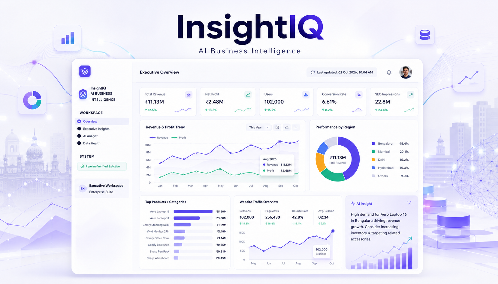

# InsightIQ — AI Business Intelligence Platform

> **An AI-powered Business Intelligence platform that converts sales data into executive KPIs, natural-language analysis, data-quality diagnostics, and actionable business recommendations.**



---

## 📌 Project Overview

**InsightIQ** is a portfolio-ready AI Business Intelligence dashboard designed to demonstrate how traditional analytics, SQL-based data processing, and Generative AI can work together in a single decision-support platform.

The project solves a common business problem: organisations often have sales data but still spend significant time preparing reports, identifying trends, finding under-performing products, and translating numbers into actions.

InsightIQ creates a complete analytics workflow:

**Raw Data → Data Cleaning → SQLite → SQL Aggregation → KPI Engine → AI Context → GenAI Analysis → Executive Insights → Strategic Actions**

The application is built with **Python, Streamlit, Pandas, NumPy, Plotly, SQLite, and the Groq API**.

---

# 1. 🎯 Problem Statement

Businesses collect large amounts of sales information across orders, products, categories, regions, quantities, prices, discounts, revenue, cost, and profit.

However, raw business data by itself does not automatically answer questions such as:

- What is our current revenue and profit?
- Which products generate the most revenue?
- Which regions contribute the most sales?
- Which products are growing or declining?
- What changed compared with the previous month?
- Where are potential business risks?
- What should management investigate next?
- Can an AI assistant answer business questions without inventing numbers?
- Can the organisation trust the underlying data before using AI-generated insights?

### The core problems addressed by InsightIQ

| Business Problem | Why It Matters | InsightIQ Response |
|---|---|---|
| Fragmented/raw sales data | Raw records are difficult to interpret | Structured cleaning + SQL data layer |
| Manual KPI preparation | Reporting consumes analyst time | Automated KPI queries |
| Poor visibility into trends | Important changes can be missed | Revenue/profit trend analysis |
| Product performance uncertainty | Growth and decline are difficult to spot | Product revenue ranking + MoM analysis |
| Regional performance uncertainty | Management needs geographic visibility | Revenue/profit by region |
| Data-quality risks | Incorrect data can create incorrect decisions | Automated integrity checks |
| Generic AI answers | LLMs may hallucinate or invent figures | Pre-aggregated SQL context |
| Unsafe text-to-SQL | Direct LLM-generated SQL can introduce risk | AI is restricted to validated analytical context |
| Numbers without actions | Dashboards may show what happened but not what to do | AI-generated strategic recommendations |
| Executive reporting gap | Technical analysis is not always manager-friendly | Executive summary and action cards |

---

# 2. 💡 Project Objectives

The main objectives are to:

- Build a unified AI-powered business intelligence workspace.
- Clean and validate raw sales data automatically.
- Store the cleaned dataset in a lightweight SQL database.
- Calculate business KPIs using SQL rather than relying on manual calculations.
- Provide interactive revenue, profit, product, and regional analysis.
- Detect month-over-month product changes.
- Provide a natural-language AI analyst.
- Ground AI responses in validated SQL aggregates.
- Generate concise executive summaries.
- Generate data-backed strategic recommendations.
- Add automated data-health and pipeline verification.
- Demonstrate a practical architecture that can be extended toward enterprise BI systems.

---

# 3. 🧠 Solution — InsightIQ Platform

InsightIQ combines four major capabilities into one workspace.

## 3.1 Executive Dashboard

The Overview page provides a management-level snapshot of the business.

### Core KPIs

- Total Revenue
- Net Profit
- Total Orders
- Average Order Value
- Overall Profit Margin

### Analytical views

- Revenue & Profit Trend
- Revenue by Region
- Product Revenue Ranking
- Product Performance Table
- Top Performer
- Top Region
- Fastest-Growing Product
- Watchlist / Declining Product
- AI-generated business snapshot

The goal is to let an executive understand the current business position before going into deeper analysis.

---

# 4. 🤖 AI Executive Intelligence

The **Executive Insights** page converts analytical results into business-oriented explanations.

It contains:

### AI Executive Summary

The model receives validated business aggregates and produces a concise summary covering:

- Overall revenue
- Profit
- Margin
- Recent changes
- Strong products
- Weak products
- Strong regions
- Important trends

### Strategic Action Cards

The AI can generate recommendations such as:

- Increase focus on high-performing products.
- Investigate declining products.
- Prioritise high-profit regions.
- Identify cross-selling opportunities.
- Review product/category performance before allocating resources.

Each recommendation is designed to be backed by a number, product, region, or trend from the analytical context.

---

# 5. 💬 AI Analyst Assistant

The **AI Analyst** page provides a natural-language interface for business questions.

Instead of navigating multiple charts, a user can ask questions such as:

```text
What is the total revenue and profit margin?
```

```text
Which products drive the most revenue?
```

```text
Which regional market performs best?
```

```text
Which product needs immediate focus?
```

```text
What changed in the latest months?
```

The assistant responds using the prepared analytical context rather than directly querying the database with arbitrary AI-generated SQL.

### Example

A question such as:

> Which products drive the most revenue?

can return the leading products with their actual revenue values, allowing the manager to immediately understand which products contribute most to sales.

---

# 6. 🛡️ AI Safety & Grounding Strategy

One of the most important technical decisions in the project is **how the LLM interacts with business data**.

## ❌ Problem with unrestricted Text-to-SQL

A simple architecture could be:

```text
User Question
      ↓
LLM
      ↓
Generated SQL
      ↓
Database
```

This can create several problems:

- Generated SQL may be incorrect.
- The model may misunderstand the schema.
- Queries may access data that should not be exposed.
- SQL injection-style risks become harder to control.
- The model may calculate metrics inconsistently.
- Answers may appear confident even when the query is wrong.

## ✅ InsightIQ approach

InsightIQ uses a controlled context architecture:

```text
User Question
      ↓
Validated SQL Aggregates
      ↓
Business Context
      ↓
Groq LLM
      ↓
Grounded Answer
```

The database calculations remain deterministic and are performed by SQL.

The LLM is responsible for **reasoning and explanation**, not for inventing business numbers.

This design makes the AI layer easier to audit and safer for a portfolio demonstration.

---

# 7. 🔄 End-to-End Data Pipeline

The complete workflow is:

```text
Raw Sales CSV
      │
      ▼
Data Cleaning
      │
      ├── Fix date types
      ├── Remove duplicate order IDs
      ├── Fill missing regions
      ├── Remove invalid revenue/quantity
      └── Create derived time & margin fields
      │
      ▼
Clean Sales CSV
      │
      ▼
SQLite Database
      │
      ▼
SQL KPI Engine
      │
      ├── Total KPIs
      ├── Monthly revenue/profit
      ├── Product performance
      ├── Regional performance
      └── Product MoM trends
      │
      ▼
AI Context Builder
      │
      ▼
Groq LLM
      │
      ├── Executive Summary
      ├── Natural-language Q&A
      └── Recommendations
      │
      ▼
InsightIQ UI
      │
      ├── Executive Dashboard
      ├── Executive Insights
      ├── AI Analyst
      └── Data Health
```

---

# 8. 🧹 Data Cleaning — Step by Step

The project intentionally generates a small amount of messy data so that the cleaning workflow demonstrates a real data-engineering process.

The cleaning logic is implemented in `clean_data.py`.

## Step 1 — Convert date fields

```python
df["order_date"] = pd.to_datetime(df["order_date"])
```

This ensures that date-based analysis can be performed consistently.

## Step 2 — Remove duplicate orders

```python
df = df.drop_duplicates(subset=["order_id"])
```

The raw dataset intentionally contains duplicate orders.

## Step 3 — Handle missing regions

```python
df["region"] = df["region"].fillna("Unknown")
```

This prevents missing geographic values from breaking regional analysis.

## Step 4 — Create analytical fields

The cleaning pipeline creates:

- `year`
- `month`
- `year_month`
- `profit_margin`

Example:

```python
df["profit_margin"] = (df["profit"] / df["revenue"]).round(4)
```

## Step 5 — Remove impossible business records

Rows with:

- revenue ≤ 0
- quantity ≤ 0

are removed.

### Result from the supplied dataset

- Raw dataset: **3,644 rows**
- Clean dataset: **3,629 rows**
- Duplicate rows removed: **15**
- Missing region values in raw data: **36**
- Missing region values after cleaning: **0**

---

# 9. 🗄️ SQL Data Layer

The project uses **SQLite** to keep deployment simple and zero-configuration.

The database is stored at:

```text
data/sales.db
```

The main table is:

```text
sales
```

All major business aggregations are intentionally calculated with SQL.

## KPI query

The KPI engine calculates:

```sql
SELECT
    ROUND(SUM(revenue), 2) AS total_revenue,
    ROUND(SUM(profit), 2) AS total_profit,
    COUNT(DISTINCT order_id) AS total_orders,
    ROUND(AVG(revenue), 2) AS avg_order_value,
    ROUND(SUM(profit) * 1.0 / SUM(revenue), 4) AS overall_margin
FROM sales;
```

This gives the application a consistent source of truth.

---

# 10. 📊 Analytical SQL Functions

The `db.py` module provides reusable analytical functions.

### `total_kpis()`

Calculates:

- Total revenue
- Total profit
- Total orders
- Average order value
- Overall margin

### `revenue_by_month()`

Returns monthly:

- Revenue
- Profit

### `revenue_by_product()`

Returns:

- Product
- Category
- Revenue
- Profit
- Units sold

### `revenue_by_region()`

Returns:

- Region
- Revenue
- Profit

### `product_month_over_month()`

Creates the product-by-month analytical dataset used to identify product growth and decline.

### `latest_two_months_comparison()`

Compares the latest two available months.

---

# 11. 📈 Current Dataset Snapshot

The supplied cleaned dataset produces approximately:

| Metric | Value |
|---|---:|
| Total Revenue | **$2,291,665.87** |
| Total Profit | **$762,071.09** |
| Profit Margin | **33.25%** |
| Orders | **3,629** |
| Average Order Value | **$631.49** |
| Units Sold | **7,670** |
| Data Period | **Jan 2024 – Dec 2025** |

The UI rounds these values for executive readability, for example:

- `$2.29M` revenue
- `$762.1K` profit
- `33.2%` margin

---

# 12. 🏆 Product Performance

The current dataset's leading products by revenue include:

| Rank | Product | Revenue |
|---:|---|---:|
| 1 | Aero Laptop 16 | $828,671.08 |
| 2 | Aero Laptop 14 | $600,077.89 |
| 3 | Comfy Standing Desk | $288,091.16 |
| 4 | Vivid Monitor 27in | $177,964.16 |
| 5 | Comfy Office Chair | $142,062.16 |

This ranking powers both the dashboard visualisation and the AI business context.

---

# 13. 🌍 Regional Performance

The current dataset shows the following revenue distribution:

| Region | Revenue |
|---|---:|
| South | $507,625.74 |
| Central | $488,066.08 |
| West | $464,753.32 |
| East | $401,215.73 |
| North | $399,794.84 |
| Unknown | $30,210.16 |

The `Unknown` category is retained because missing regions are explicitly handled during cleaning rather than silently discarded.

---

# 14. 📉 Trend & Change Detection

The project deliberately creates business patterns in the synthetic dataset so that analytical questions have meaningful answers.

One important pattern is a revenue dip in **November 2025**.

The monthly values include:

| Month | Revenue |
|---|---:|
| Jul 2025 | $99,042.42 |
| Aug 2025 | $92,863.86 |
| Sep 2025 | $104,343.44 |
| Oct 2025 | $123,848.38 |
| Nov 2025 | $59,213.66 |
| Dec 2025 | $112,891.89 |

Revenue recovered strongly in December after the November dip.

This is useful for demonstrating why an AI analyst needs access to historical context rather than only a single KPI.

---

# 15. 🧠 How the AI Context Is Built

The core logic is in:

```text
ai_helpers.py
```

The `_build_business_context()` function gathers:

1. Company-level KPIs.
2. The latest six months of revenue/profit.
3. Revenue by product.
4. Revenue by region.
5. Product month-over-month changes.

The result is converted into a compact business context.

Conceptually:

```text
SQLite
  ↓
SQL Aggregates
  ↓
Python Context Builder
  ↓
Structured Business Context
  ↓
LLM Prompt
  ↓
Answer / Summary / Recommendation
```

---

# 16. 🔐 Environment Configuration

The application requires a Groq API key for AI features.

Create a local `.env` file:

```env
GROQ_API_KEY=your_groq_api_key
```

You can optionally configure the model:

```env
GROQ_MODEL=openai/gpt-oss-120b
```

The application reads configuration from environment variables and Streamlit secrets.

> **Security:** Never commit a real API key to GitHub. The supplied project contains an `.env` file, so replace/remove any real credentials before publishing the repository.

---

# 17. 🧰 Technology Stack

| Technology | Purpose |
|---|---|
| Python | Core application and data processing |
| Streamlit | Interactive dashboard UI |
| Pandas | Data cleaning and transformation |
| NumPy | Synthetic data generation |
| SQLite | Local SQL database |
| Plotly | Interactive visualisations |
| Groq API | Generative AI inference |
| Python-dotenv | Environment configuration |
| HTML/CSS | Premium dashboard styling |

---

# 18. 🏗️ Application Architecture

```text
                    ┌──────────────────────┐
                    │     Sales Dataset    │
                    └──────────┬───────────┘
                               │
                               ▼
                    ┌──────────────────────┐
                    │   clean_data.py      │
                    │ Cleaning + Validation │
                    └──────────┬───────────┘
                               │
                               ▼
                    ┌──────────────────────┐
                    │     SQLite / sales   │
                    │       Database       │
                    └──────────┬───────────┘
                               │
                               ▼
                    ┌──────────────────────┐
                    │        db.py         │
                    │ SQL KPI / Aggregates  │
                    └──────────┬───────────┘
                               │
                    ┌──────────┴───────────┐
                    ▼                      ▼
          ┌─────────────────┐     ┌──────────────────┐
          │ Streamlit UI    │     │ ai_helpers.py    │
          │ Charts + KPIs   │     │ Context + LLM     │
          └────────┬────────┘     └────────┬─────────┘
                   │                       │
                   └───────────┬───────────┘
                               ▼
                    ┌──────────────────────┐
                    │      InsightIQ       │
                    │ Executive Decisions   │
                    └──────────────────────┘
```

---

# 19. 📁 Project Structure

The supplied project is intentionally lightweight:

```text
ai_Business_dashboard-main/
│
├── app.py
├── ai_helpers.py
├── clean_data.py
├── db.py
├── generate_data.py
├── requirements.txt
├── .env
│
└── data/
    ├── raw_sales.csv
    ├── clean_sales.csv
    └── sales.db
```

### File responsibilities

#### `app.py`

Main Streamlit application containing:

- Sidebar navigation
- Overview dashboard
- Executive Insights
- AI Analyst
- Data Health
- Charts
- KPI cards
- UI styling
- Session-based chat history

#### `ai_helpers.py`

AI integration layer containing:

- Groq client
- Model configuration
- Retry logic
- Business context construction
- Executive summary generation
- Recommendation generation
- Natural-language Q&A
- Recommendation parsing

#### `db.py`

SQL/data-access layer containing:

- SQLite connection
- Data loading
- KPI queries
- Monthly aggregation
- Product aggregation
- Regional aggregation
- Product MoM data

#### `clean_data.py`

Data-quality pipeline.

#### `generate_data.py`

Synthetic sales data generator with intentional:

- Product trends
- Seasonality
- Revenue dip
- Missing regions
- Duplicate records

#### `data/`

Contains the raw/cleaned datasets and SQLite database.

---

# 20. ▶️ How to Run the Project

## Step 1 — Clone the repository

```bash
git clone <YOUR_GITHUB_REPOSITORY_URL>
cd ai_Business_dashboard-main
```

## Step 2 — Create a virtual environment

### Windows

```bash
python -m venv .venv
.venv\Scripts\activate
```

### macOS / Linux

```bash
python3 -m venv .venv
source .venv/bin/activate
```

## Step 3 — Install dependencies

```bash
pip install -r requirements.txt
```

## Step 4 — Configure the API key

Create `.env`:

```env
GROQ_API_KEY=your_groq_api_key
```

Optional:

```env
GROQ_MODEL=openai/gpt-oss-120b
```

## Step 5 — Regenerate the raw dataset if required

```bash
python generate_data.py
```

## Step 6 — Clean the dataset

```bash
python clean_data.py
```

## Step 7 — Load the cleaned data into SQLite

```bash
python db.py
```

## Step 8 — Start Streamlit

```bash
streamlit run app.py
```

The application will open in the browser at the local Streamlit address shown in the terminal.

---

# 21. 🔍 Data Health & System Diagnostics

The Data Health page acts as a lightweight observability layer.

It checks:

### 1. Database file existence

Confirms:

```text
data/sales.db
```

exists and is accessible.

### 2. Table structure

Confirms the `sales` table contains the expected business data.

### 3. KPI calculation accuracy

Confirms revenue and profit aggregates are available and non-null.

### 4. Date range consistency

Confirms year/month analytical groupings can be generated.

### 5. AI context serialization

Confirms analytical information can be prepared for the AI layer.

This creates a simple but useful principle:

> **Do not send business data to an AI layer until the analytical pipeline has passed basic integrity checks.**

---

# 22. 🎨 UI / UX Design

InsightIQ uses a light-first enterprise dashboard design.

### Design characteristics

- White analytical surfaces
- Soft grey background
- Indigo primary colour
- Teal/green positive indicators
- Red risk indicators
- Rounded cards
- Minimal visual noise
- Responsive Streamlit layout
- Executive-friendly KPI hierarchy
- Consistent typography
- Plotly-based interactive charts

The interface is divided into four logical workspaces:

```text
Overview
   ↓
Executive Insights
   ↓
AI Analyst
   ↓
Data Health
```

---

# 23. 🧩 Major Features

### Executive Dashboard

- KPI cards
- Revenue trend
- Profit trend
- Regional revenue
- Product ranking
- Product performance table
- AI business snapshot
- Change detection feed

### Executive Intelligence

- AI executive briefing
- Strategic action cards
- Data-backed recommendations
- Architecture pipeline

### AI Analyst

- Natural-language questions
- Suggested analytical prompts
- Conversation history
- SQL-grounded context
- Business-friendly answers

### Data Health

- Dataset status
- Record count
- Data-quality indicators
- Pipeline status
- Integrity checks

---

# 24. 📌 Example Business Questions

The AI Analyst is designed for questions such as:

```text
What is the total revenue?
```

```text
What is the overall profit margin?
```

```text
Which products generate the most revenue?
```

```text
Which region contributes the most revenue?
```

```text
Which products are declining?
```

```text
What changed in the latest months?
```

```text
Which products should management investigate?
```

```text
What strategic actions could improve performance?
```

The assistant should answer only when the required information exists in the supplied business context.

---

# 25. 🧪 Synthetic Data Design

The project does not rely on a confidential corporate dataset.

Instead, `generate_data.py` creates synthetic sales records while deliberately embedding realistic patterns.

The generator includes:

### Product trends

Products can be:

- Growing
- Stable
- Declining

### Seasonality

Monthly seasonality creates realistic variations in demand.

### November 2025 dip

A deliberate November 2025 revenue reduction is included to create a meaningful analytical event.

### Data-quality issues

The generator intentionally inserts:

- Missing regions
- Duplicate rows

This makes the cleaning pipeline demonstrable rather than decorative.

---

# 26. 🚀 Why This Architecture Works

The project separates responsibilities:

```text
SQL = deterministic calculations
Python = orchestration and transformation
Plotly = visual analytics
Streamlit = user experience
LLM = reasoning and explanation
```

This is important because the AI model is not treated as the source of truth.

The database remains the source of numerical truth.

The AI layer adds interpretation.

---

# 27. ⚠️ Current Limitations

This is a portfolio/demo architecture rather than a production enterprise platform.

Current limitations include:

- Synthetic rather than live enterprise data.
- SQLite is intended for lightweight local usage.
- AI features require a Groq API key.
- AI answers are limited to the pre-computed context.
- No enterprise authentication/SSO is implemented.
- No row-level security is implemented.
- No automated cloud deployment pipeline is included.
- No scheduled production ETL pipeline is included.
- No external ERP/CRM connectors are included.
- Data-health checks are lightweight application-level checks.

These limitations are intentional and provide clear opportunities for future development.

---

# 28. 🔮 Future Enhancements

Potential production-oriented improvements include:

### Data Engineering

- PostgreSQL / Azure SQL / Snowflake integration
- Scheduled ETL pipelines
- Incremental data loading
- Data warehouse modelling
- dbt transformations
- Airflow or cloud orchestration

### AI

- Retrieval-Augmented Generation for business documentation
- Tool-based analytics with strict SQL allow-lists
- Multi-agent business analysis
- Forecasting
- Anomaly detection
- Natural-language chart generation
- Explainable recommendation scoring

### Security

- Authentication
- Role-based access control
- Row-level security
- Secret management
- Audit logs
- Prompt/response monitoring

### Deployment

- Docker
- Streamlit Cloud
- Azure
- AWS
- CI/CD
- Production monitoring

### Analytics

- Customer segmentation
- Sales forecasting
- Product profitability
- Discount analysis
- Cohort analysis
- Regional forecasting
- Inventory optimisation

---

# 29. 🧭 Step-by-Step Problem → Solution Mapping

## Problem 1: Raw data is difficult to analyse

**Solution:** Build a repeatable Pandas cleaning pipeline.

```text
Raw CSV
 → type fixes
 → duplicate removal
 → missing-value handling
 → derived metrics
 → validated dataset
```

## Problem 2: Manual KPI calculations

**Solution:** Centralise calculations in SQL.

```text
sales table
 → SQL aggregation
 → KPI DataFrame
 → dashboard
```

## Problem 3: Trends are difficult to see

**Solution:** Aggregate revenue/profit by month and visualise the time series.

## Problem 4: Product performance is unclear

**Solution:** Group by product/category and rank by revenue, profit, and units.

## Problem 5: Regional performance is unclear

**Solution:** Aggregate and visualise revenue/profit by region.

## Problem 6: Business users want natural-language answers

**Solution:** Add an AI Analyst interface.

## Problem 7: AI may invent numbers

**Solution:** Feed the model validated SQL aggregates and instruct it to use only supplied data.

## Problem 8: AI answers alone are not enough

**Solution:** Add executive summaries and actionable recommendations.

## Problem 9: Poor data can produce poor AI insights

**Solution:** Add a Data Health page with automated integrity checks.

## Problem 10: Executives need a single place to understand the business

**Solution:** Combine KPIs, charts, AI insights, recommendations, and diagnostics into one workspace.

---

# 30. 🏁 Final Outcome

InsightIQ demonstrates an end-to-end **AI + Analytics + SQL** workflow rather than a dashboard that only displays charts.

The final platform connects:

```text
DATA
 ↓
QUALITY
 ↓
SQL
 ↓
ANALYTICS
 ↓
AI
 ↓
INSIGHTS
 ↓
ACTIONS
```

The result is a portfolio-ready Business Intelligence application that demonstrates:

- Python development
- Data cleaning
- SQL analytics
- SQLite
- KPI engineering
- Interactive visualisation
- Streamlit application development
- Generative AI integration
- Prompt/context design
- AI grounding
- Data-quality validation
- Executive reporting
- Business recommendation generation

---

# 31. 📸 Application Screens

The repository can include the dashboard screenshots alongside this README:

```text
docs/
├── insightiq-hero.png
├── overview.png
├── executive-insights.png
├── ai-analyst.png
└── data-health.png
```

Recommended README presentation order:

1. Hero image
2. Problem statement
3. Solution architecture
4. Main features
5. Screenshots
6. Data pipeline
7. AI architecture
8. Installation
9. Project structure
10. Future roadmap

---

# 32. 👨‍💻 Portfolio Positioning

**InsightIQ** can be presented as:

> **An AI-powered Business Intelligence platform that combines SQL-driven analytics with grounded Generative AI to transform raw sales data into executive insights and actionable recommendations.**

### Skills demonstrated

`Python` · `SQL` · `Pandas` · `NumPy` · `SQLite` · `Streamlit` · `Plotly` · `Generative AI` · `Groq API` · `Data Cleaning` · `Data Quality` · `Business Intelligence` · `Prompt Engineering` · `Analytics`

---

## ⭐ Project Philosophy

> **The dashboard tells you what happened.  
> The analytics explain what changed.  
> The AI helps explain why it matters.  
> The recommendations suggest what to investigate next.**

That is the core idea behind **InsightIQ**.

---

## 📄 License

Add the licence that matches your intended repository usage, for example MIT, before publishing the project publicly.

---

## 🙌 Acknowledgement

Built as a portfolio and executive-demo project to demonstrate practical integration of **Business Intelligence, SQL analytics, data quality, and Generative AI**.
